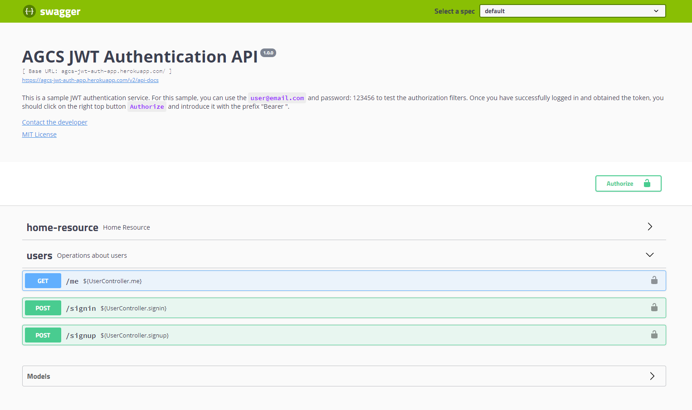
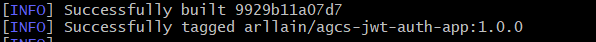
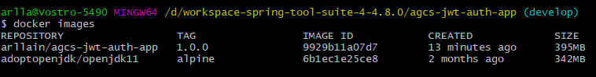
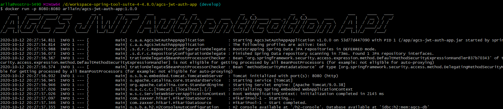
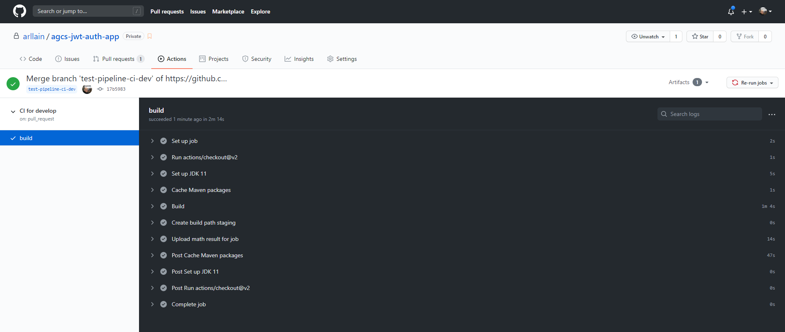

# AGCS JWT Authentication API
&nbsp;


***


&nbsp;

## This is a sample JWT authentication RESTful API.

&nbsp;
&nbsp;


## Project structure

```
agcs-jwt-auth-app/
 │
 ├── src/main/java/
 │   └── com/arllain/agcsjwtauthapp
 │       ├── config
 │       │   ├── SwaggerConfig.java
 │       │   └── TestConfig.java
 │       │
 │       ├── domain
 │       │   ├── Telephone.java
 │       │   └── User.java
 │       │
 │       ├── dto
 │       │   ├── TelephoneDataDTO.java
 │       │   ├── UserDataDTO.java
 │       │   ├── UserResponseDTO.java
 │       │   └── UserSignInDTO.java
 │       │
 │       ├── exception
 │       │   └── CustomException.java
 │       │
 │       ├── repositories
 │       │   └── UserRepository.java
 │       │
 │       ├── resources
 │       │   └── exception
 │       │   │    ├── AuthorizationException.java
 │       │   │    ├── FieldMessage.java
 │       │   │    ├── ResourceExceptionHandler.java
 │       │   │    ├── StandardError.java
 │       │   │    └── ValidationError.java
 │       │   └── HomeResource.java
 │       │   └── UserResource.java
 │       │
 │       ├── security
 │       │   ├── JwtAuthenticationEntryPoint.java
 │       │   ├── JwtTokenFilter.java
 │       │   ├── JwtTokenFilterConfigurer.java
 │       │   ├── JwtTokenProvider.java
 │       │   └── WebSecurityConfig.java
 │       │
 │       ├── services
 │       │   └── exception
 │       │   │   ├── AuthenticationCustomException.java
 │       │   │   ├── ObjectFoundException.java
 │       │   │   └── ObjectNotFoundException.java
 │       │   └── UserDetailsServiceImpl.java
 │       │   └── UserService.java
 │       │
 │       └── AgcsJwtAuthAppApplication.java
 │
 ├── src/main/resources/
 │   ├── application.properties
 │   ├── application-test.properties
 │   └── banner.text
 │
 │
 ├── .gitignore
 ├── mvnw
 ├── mvnw.cmd
 ├── pom.xml
 └── README.md
```


***
&nbsp;

## You can access the api in Heroku at: [agcs-jwt-auth-app](https://agcs-jwt-auth-app.herokuapp.com/swagger-ui.html)

&nbsp;

<p align="left">
  
</p>

***
&nbsp;

## How to use this code?
&nbsp;

1. Make sure you have [Java 11](https://www.java.com/download/) and [Maven](https://maven.apache.org) installed


2. Clone this repository
  
```
$ git clone https://github.com/arllain/agcs-jwt-auth-app
```

3. Navigate into the folder  

```
$ cd agcs-jwt-auth-app
```

4. Install dependencies

```
$ mvn install
```

5. Run the project

```
$ mvn spring-boot:run
```

6. Navigate to `http://localhost:8080/swagger-ui.html` in your browser to check everything is working correctly. You can change the default port in the `application.porperties` file

```properties
server.port=8081
```


7. Make a GET request to `/me` to check you're not authenticated. You should receive a response with a `401` with an `Unauthorized` message since you haven't set your valid JWT token yet.

```
$ curl -X GET "http://localhost:8080/me" -H "accept: */*"
```

8. Make a POST request to `/signin`, with the new user you created or you can use the default user (user@email.com and password 123456), we programatically created to get a valid JWT token

```
$ curl -X POST "http://localhost:8080/signin" -H "accept: */*" -H "Content-Type: application/json" -d "{ \"email\": \"user@email.com\", \"password\": \"123456\"}"
```

9. Add the JWT token as a Header parameter and make the initial GET request to `/me` again

```
$ curl -X GET http://localhost:8080/users/me -H 'Authorization: Bearer <JWT_TOKEN>'
```

10. You should get a similar response to this one, meaning that you're now authenticated

```javascript
{
  "firstName": "John",
  "lastName": "Doe",
  "email": "user@email.com",
  "phones": [
    {
      "number": 34270008,
      "area_code": 81,
      "country_code": "+55"
    },
    {
      "number": 999912248,
      "area_code": 81,
      "country_code": "+55"
    }
  ],
  "created_at": "2020-10-12T14:50:15.692483Z",
  "last_login": "2020-10-12T15:10:54.206899Z"
}
```

11. To create a new user make a POST request to `/signup` to create a new user

```
$ curl -X POST "http://localhost:8080/signup" -H "accept: */*" -H "Content-Type: application/json" -d "{ \"firstName\":\"Arllain\", \"lastName\":\"Silva\", \"email\":\"as@gmail.com\", \"password\":\"123456\", \"phones\":[ { \"number\":\"34568890\", \"area_code\":81, \"country_code\":\"+55\" }, { \"number\":988887888, \"area_code\":81, \"country_code\":\"+55\" } ]}"
```


12. You should get a response with a `400` with an `Bad Request` similar response to this one, meaning validation error

```javascript
{
  "status": 400,
  "msg": "Validation error",
  "timeStamp": 1602516639430,
  "errors": [
    {
      "fieldName": "email",
      "message": "You must enter a valid email"
    }
  ]
}
```

13. You should get a response with a `401` with an `Unauthorized` similar response to this one, meaning validation error

```javascript
{
  "status": 401,
  "msg": "Invalid e-mail or password",
  "timeStamp": 1602517073936
}
```


***
&nbsp;
&nbsp;

## Docker

There is a Dockerfile in project's root which has the configuration to create a docker image with dockerfile maven

```
FROM adoptopenjdk/openjdk11:alpine
RUN addgroup -S spring && adduser -S spring -G spring
USER spring:spring
VOLUME /tmp
ARG JAR_FILE
ADD ${JAR_FILE} /app/agcs-jwt-auth-app.jar
EXPOSE 8080
ENTRYPOINT ["java","-Djava.security.egd=file:/dev/./urandom","-jar","/app/agcs-jwt-auth-app.jar"]

```
&nbsp;

Run this command to create a docker image

```
$ mvn package

```

On completion of the mvn package command you should see a message indicating the docker image has been created

<p align="left">
  
</p> 

Run this command to list available docker images

```
$ docker images

```

<p align="left">
  
</p> 


Now you can run the new Docker image

```

$ docker run -p 8080:8080 arllain/agcs-jwt-auth-app:1.0.0

```


You should see your app running

<p align="left">
  
</p> 

---


## CI/CD


There is pipeline ci-dev.yml that is executed everytime the develop branch receives a pull request

```
name: CI  for develop

on:
  pull_request:
    branches: [ develop ]

jobs:
  build:

    runs-on: ubuntu-latest

    steps:
      - uses: actions/checkout@v2
      - name: Set up JDK 11
        uses: actions/setup-java@v1
        with:
          java-version: 11
      - name: Cache Maven packages
        uses: actions/cache@v1
        with:
          path: ~/.m2
          key: ${{ runner.os }}-m2-${{ hashFiles('**/pom.xml') }}
          restore-keys: ${{ runner.os }}-m2
      - name: Build
        run: mvn -B package --file pom.xml
      - name: Create build path staging
        run: mkdir staging && cp target/*.jar staging
      - name: Upload math result for job
        uses: actions/upload-artifact@v1
        with:
          name: agcs-jwt-auth-app
          path: staging
```
&nbsp;

This is a exemple of the pipeline CI for develop in github

<p align="left">
  
</p> 

&nbsp;
&nbsp;

There is pipeline ci-prod.yml that is executed everytime the master branch receives a pull request

```
name: CI for PRD

on:
  push:
    branches: [ master ]
  pull_request:
    branches: [ master ]
    

jobs:
  build_and_test:
    runs-on: ubuntu-latest

    steps:
    - uses: actions/checkout@v2
    - name: Set up JDK 11
      uses: actions/setup-java@v1
      with:
        java-version: 11
    - name: Cache Maven packages
      uses: actions/cache@v1
      with:
        path: ~/.m2
        key: ${{ runner.os }}-m2-${{ hashFiles('**/pom.xml') }}
        restore-keys: ${{ runner.os }}-m2
    - name: Build
      run: mvn -B package --file pom.xml
    - name: Maven clean Package
      run: mvn -B clean package -DskipTests
    - name: Tests
      run: mvn -B clean verify
    - name: Creating artifact
      run: mkdir production && cp target/*.jar production
    - name: Upload Artifact
      uses: actions/upload-artifact@v1     
      with:
        name: agcs-jwt-auth-app
        path: production

```


---

Made with 💜 by Arllain 👋 [See my linkedin](https://www.linkedin.com/in/arllain/)


